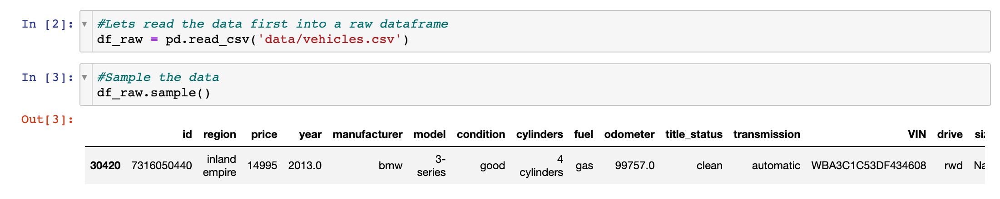
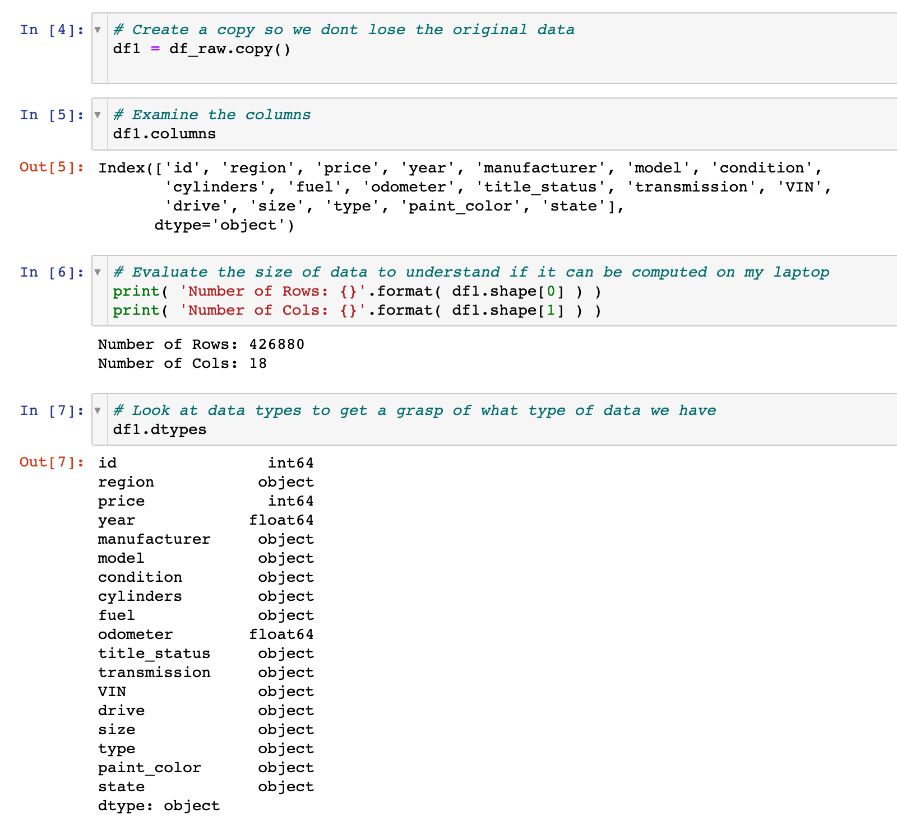
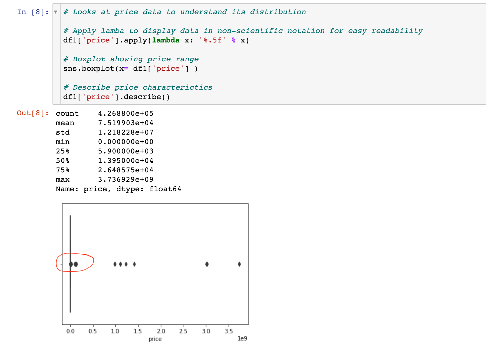
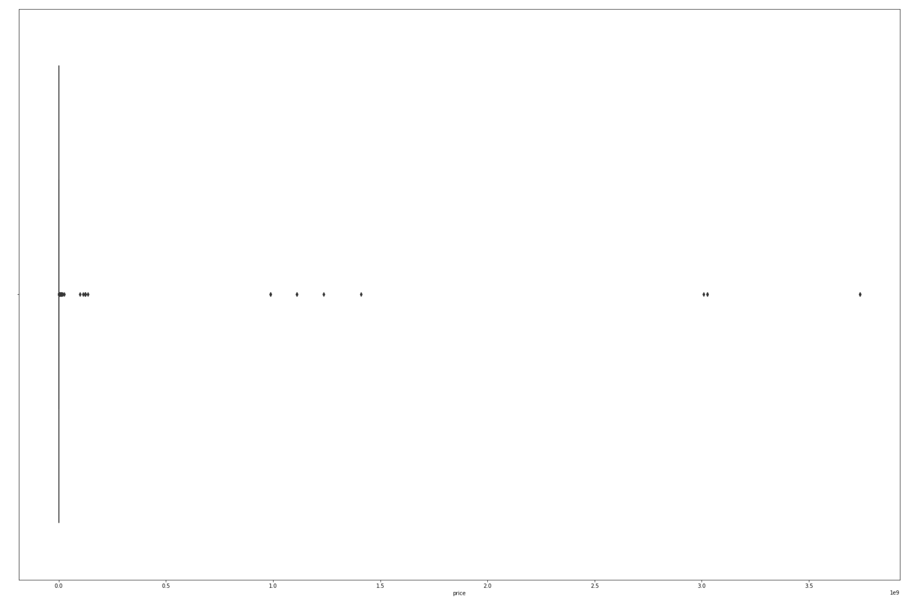
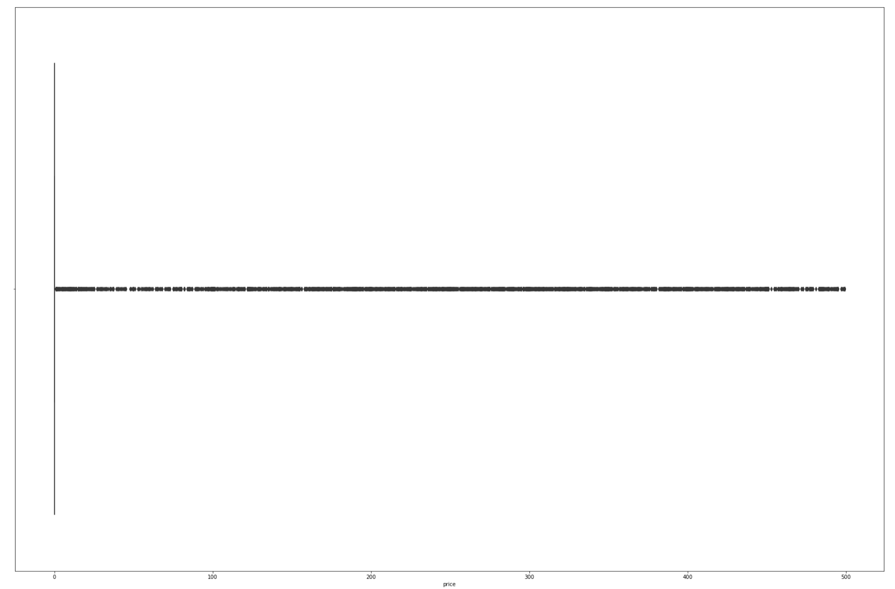
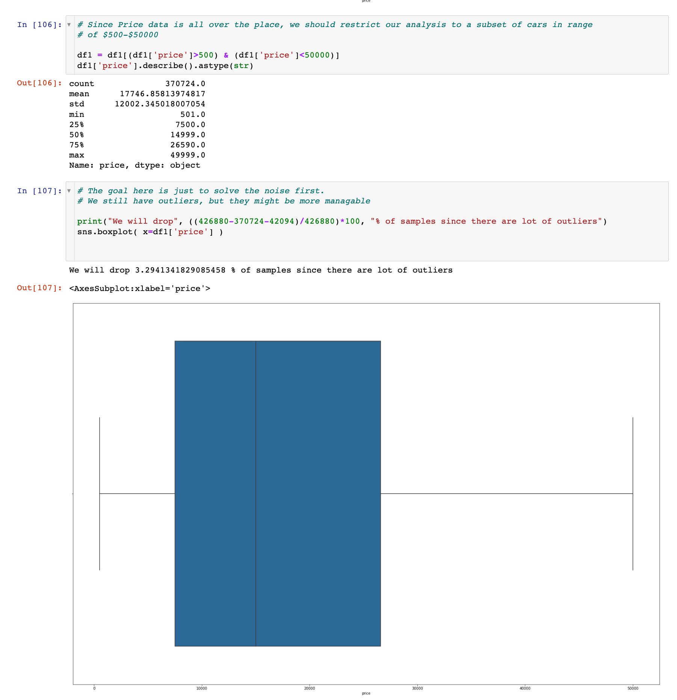

# What drives the price of a car?

## Overview

In this application, we will explore a dataset from kaggle that contains information on 3 million used cars. Our goal is to understand what factors make a car more or less expensive. As a result of your analysis, we should provide clear recommendations to our client -- a used car dealership -- as to what consumers value in a used car.

### CRISP-DM Framework

    

To frame the task, throughout our practical applications we will refer back to a standard process in industry for data projects called CRISP-DM.  This process provides a framework for working through a data problem. 

## Business Understanding

From a business perspective, we are tasked with identifying key drivers for used car prices.  In the CRISP-DM overview, we are asked to convert this business framing to a data problem definition.  

### Factors driving car price

As a car dealership, profit is tied to car selling quickly and with a good margin. As a business user, I would like to understand how some of the factors below affect the price of the car.

#### Car condition

1. As a car salesman, I wonder if the paint color matters to the customer. For eg. do customer prefer to buy silver color cars?

2. Does Used cars which has interior with good condition more expensive?

3. Are cars with high mileage cheaper?

4. Are cars with better appearance expensive?

#### Location

1. Are cars located in periphery neighborhood cheaper?

2. Do cars in west or northeast regions cost more due to higher cost of living?

3. Do cars in urban environments cost more compared to rural locations?

#### Car brand and type

1. Are used cars with less size cheaper (eg. Sedan vs SUV)?

2. Are cars from bigger manufacturer more expensive?

3. Does 4wd drive cost more?

4. Used cars belongs to luxury segment should cost more.

5. Are electric fuel care more expensive?

#### Car accessories (eg. Airconditioning, Airbags, Stereos)

1. Does automatic transmission cost more?

2. Are cars with high-end stereos more expensive?

3. Are cars with less Airbags cheaper?

4. Do cars with air-condition cost more?

5. Do cars with more cylinders cost more?

#### Car age

1. Should used cars which has lifetime longer be cheaper?

2. Do cars with less age should cost less?

3. Are cars selling in holidays more expensive?

#### Car sales channel

1. Are used cars selling in online store cheaper?

1. Are used cars being sold by owner cheaper?

1. Are used cars selling in physical store expensive?

## Data Understanding

After considering the business understanding, we want to get familiar with our data. For doing that, I first loaded the dataframe by reading the csv file. I also sampled the data to see what type of data we are looking at

I looked the size of the data and evaluated data types to gain how our data is orgazined.

As we are predicting price, I looked at the boxplot.

## Data Preparation

The price data is all over the place. I did a quick box plot of cars with prices >50000, prices <500 

| Boxplot of cars with price > 50000            |  Boxplot of cars with price < 500  |
:-------------------------:|:-------------------------:
  |  

I decided to drop data for cars in above range and did a quick box plot to check data spread

Once we did that, I checked the data shape and figured out how many null values my dataset has. I saw that there are few rows with empty year values, so I decided to drop that data

Next I checked the unique values in the data.

I also cleaned up data further and then used one-hot encoder to setup 

## Modelling

## Evaluations

## Next steps and recommendations

