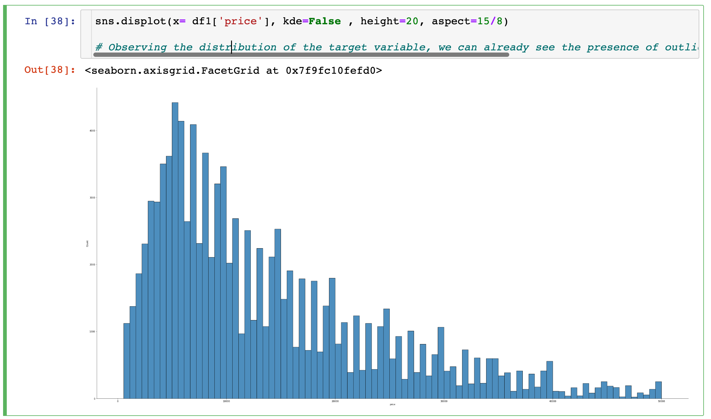
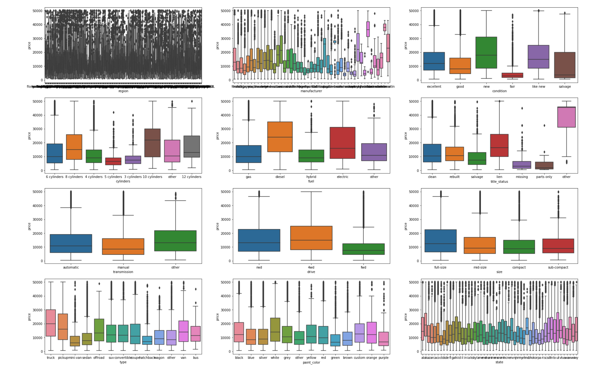
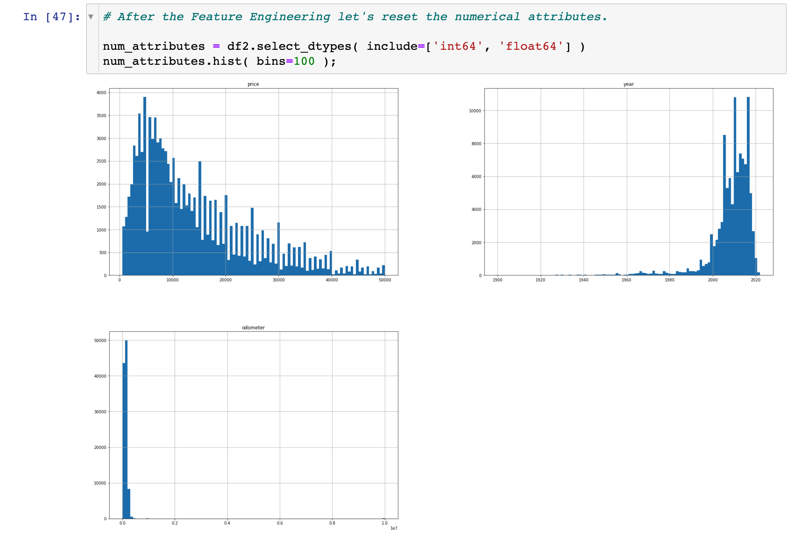
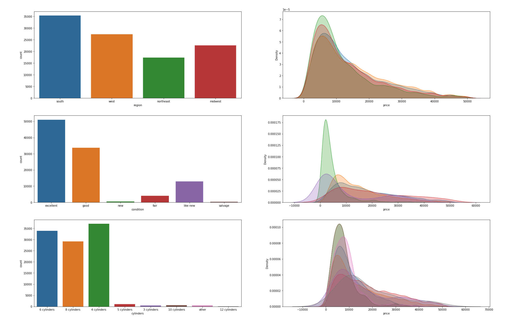
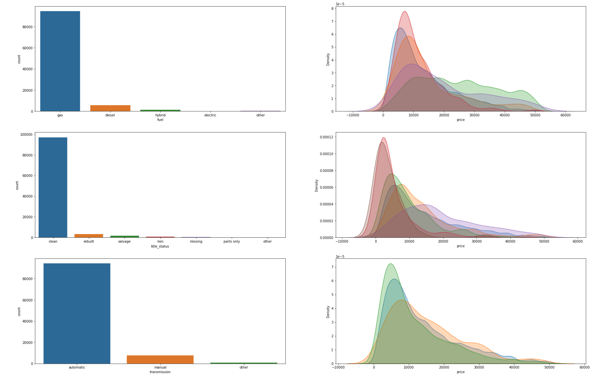
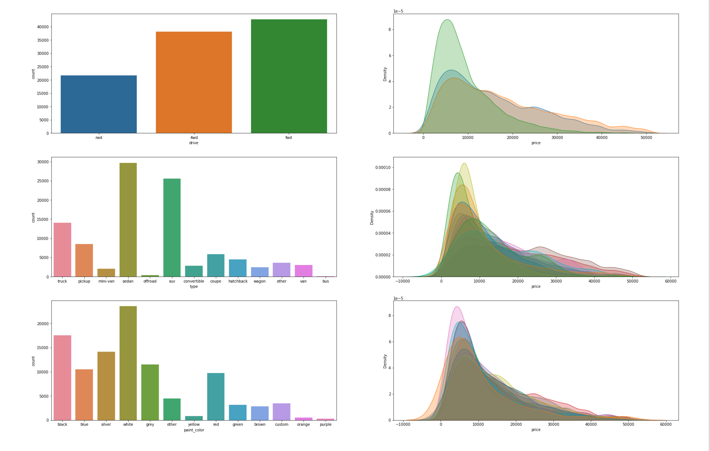
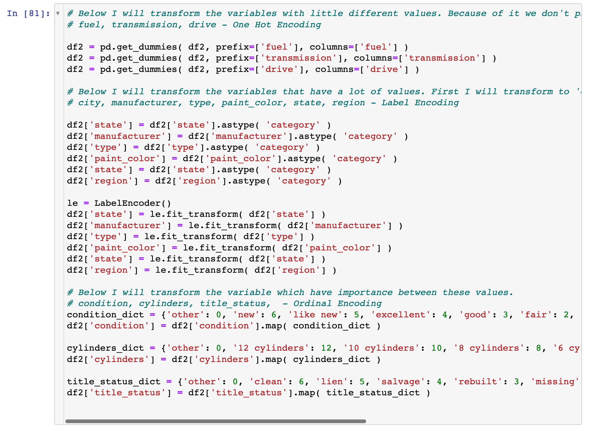
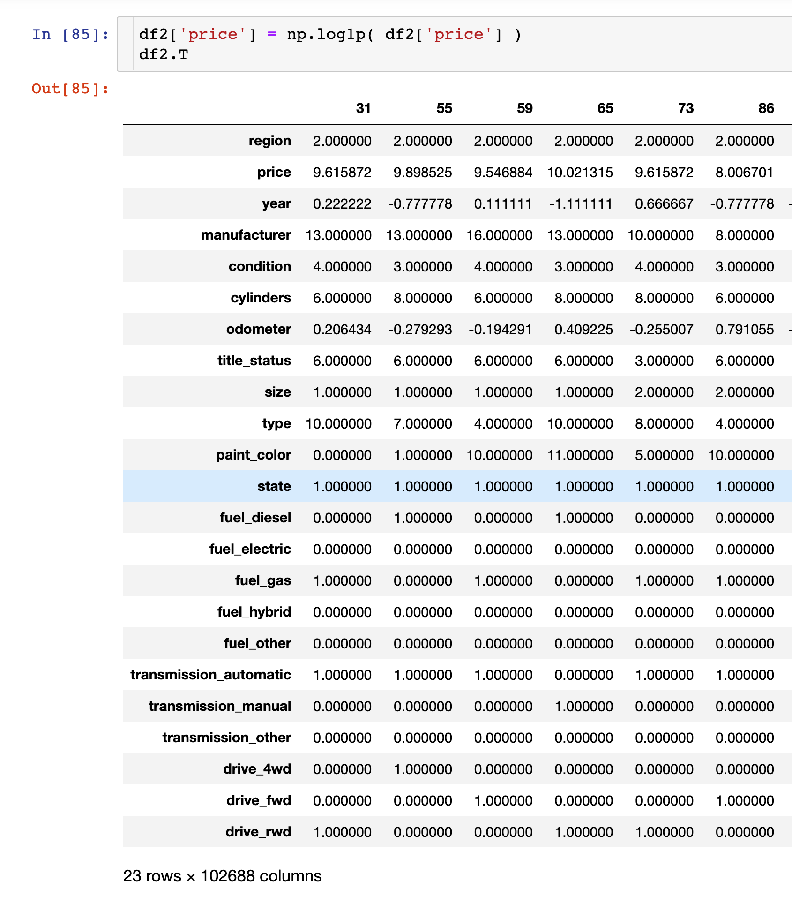
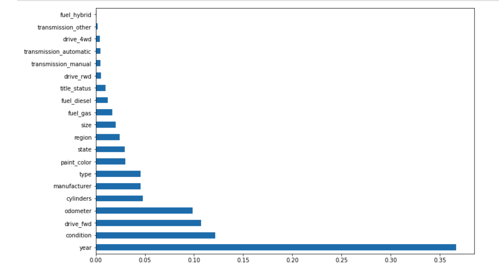

# What drives the price of a car?


## Overview

In this application, we will explore a dataset from kaggle that contains information on 3 million used cars. Our goal is to understand what factors make a car more or less expensive. As a result of your analysis, we should provide clear recommendations to our client -- a used car dealership -- as to what consumers value in a used car.


### CRISP-DM Framework

<center>
    
</center>


To frame the task, throughout our practical applications we will refer back to a standard process in industry for data projects called CRISP-DM.  This process provides a framework for working through a data problem. 


## Business Understanding

From a business perspective, we are tasked with identifying key drivers for used car prices.  In the CRISP-DM overview, we are asked to convert this business framing to a data problem definition.  

### Factors driving car price

As a car dealership, profit is tied to car selling quickly and with a good margin. As a business user, I would like to understand how some of the factors below affect the price of the car.

#### Car condition

1. As a car salesman, I wonder if the paint color matters to the customer. For eg. do customer prefer to buy silver color cars?

2. Does Used cars which has interior with good condition more expensive?

3. Are cars with high mileage cheaper?

4. Are cars with better appearance expensive?

#### Location

1. Are cars located in periphery neighborhood cheaper?

2. Do cars in west or northeast regions cost more due to higher cost of living?

3. Do cars in urban environments cost more compared to rural locations?

#### Car brand and type

1. Are used cars with less size cheaper (eg. Sedan vs SUV)?

2. Are cars from bigger manufacturer more expensive?

3. Does 4wd drive cost more?

4. Used cars belongs to luxury segment should cost more.

5. Are electric fuel care more expensive?


#### Car accessories (eg. Airconditioning, Airbags, Stereos)

1. Does automatic transmission cost more?

2. Are cars with high-end stereos more expensive?

3. Are cars with less Airbags cheaper?

4. Do cars with air-condition cost more?

5. Do cars with more cylinders cost more?

#### Car age

1. Should used cars which has lifetime longer be cheaper?

2. Do cars with less age should cost less?

3. Are cars selling in holidays more expensive?

#### Car sales channel

1. Are used cars selling in online store cheaper?

1. Are used cars being sold by owner cheaper?

1. Are used cars selling in physical store expensive?

## Data Understanding

All the analysis can be found in the python [notebook](UserCarPriceModelling.ipynb) to follow the code and operations explained below.

After considering the business understanding, we want to get familiar with our data. For doing that, I first loaded the dataframe by reading the csv file. I also sampled the data to see what type of data we are looking at


I looked the size of the data and evaluated data types to gain how our data is orgazined.


As we are predicting price, I looked at the boxplot.


## Data Preparation

The price data is all over the place. I did a quick box plot of cars with prices >50000, prices <500 


| Boxplot of cars with price > 50000            |  Boxplot of cars with price < 500  |
:-------------------------:|:-------------------------:
  |  


I decided to drop data for cars in above range and did a quick box plot to check data spread


Once we did that, I checked the data shape and figured out how many null values my dataset has. I saw that there are few rows with empty year values, so I decided to drop that data


Next I checked the unique values in the data.

```
Unique no. of years 112
Unique no. of manufacturer 42
Unique no. of model 26175
Unique no. of condition 6
Unique no. of cylinders 8
Unique no. of fuel 5
Unique no. of title_status 6
Unique no. of transmission 3
Unique no. of drive 3
Unique no. of type 13
Unique no. of paint_bolor 12
```

I further looked into the model column and noticed that manufacturer columns can be used to rebuild the data for missing models. I did a lambda transform and some additional analysis to populate the missing data. 

Once models, were figured out I dropped the NaN values for those and corrected the data for other columns to `other` so I can consider them for my analysis

I also decided to drop ID, model and VIN data to sanitize the data further.

Before going further, I checked the distribution of price



I also did a box plot of categorical values to see how they are distributed



As you can see the state value was very noisy, I thought it may be better to create a smaller set by mapping the states using the logic below:

```
Northeast: ct, me, ma, nh, ri, vt, nj, ny, and pa
Midwest: il, in, mi, oh, wi, ia, ks, mn, mo, ne, nd, and sd
South: de, fl, ga, md, nc, sc, va, dc, wv, al, ky, ms, tn, ar, la, ok, and tx
West: az, co, id, mt, nv, nm, ut, wy, ak, ca, hi, or, and wa
```

Since price had lot of outliers, I decided to reduce the data further to cars between 500 and 50000 since that seems to be a more resonable range for a typical used car. I then reviewed the histogram again for my data



Next I focused on categorical values. I started by dropping duplicates and did some kde plots on processed data. This helped me look at relationship between different variables







You can follow-along in my notebook for a series of hypothesis that I validated with my data.

Since the data still had some categorical values, I did a transform to bring data in numerical format



I also tranformed pricing data using log transform before proceeding to next step. The image below shows the final data snapshot before starting the modeling.



## Modelling

First I extracted the feature importance to understand which features are important



Then I did a training and test data split and transformed the data

```
VERBOSE = 0
SEED = 42

from sklearn.preprocessing import StandardScaler, MinMaxScaler
from sklearn.model_selection import train_test_split

X_train , X_test, y_train, y_test = train_test_split(X, y, random_state = SEED , test_size=0.2)

scaler = StandardScaler()
X_train = scaler.fit_transform(X_train)
X_test = scaler.transform(X_test)

```

Follow along the python notebook for more details.

Using LinearRegression model, I saw accuracy was pretty low (38%). I tried the RandomForestRegressor model which had a much better accuracy (97% on training set, and 83% on test set)

I also applied Ridge and Lasso regressions to further tune the model. 


## Evaluations

Based on the modeling, our team can provide dealers with price forecast based on their inventory. The accuracy of LinearRegression is not very high, so I tried the random forest regressor which yielded much better accuracy against our training and test data. There are some additional hypothesis that we were able to verify for our dealers. They are listed below for reference as a FAQ with more details on plots that provide details behind these answers in earlier section of notebook.

Q: Are used cars with higher mileage cheaper 

A: True

Q: Used cars with better appearance should be expensive

A: True

Q: Used cars in west or northeast regions should cost more.

A: False

Q: Used car in expensive states like CA cost more

A: False 

Q: Used cars which come from big manufacturer should cost more

A: True

Q: Used cars with electric fuel should be expensive

A: False

Q: Used cars with SUV, pickup or truck type should cost more 

A: True

Q: Used cars with automatic transmission should cost more

A: True


## Next steps and recommendations


Based on the findings from analysis, 4 key features, along with their importance is below

|Feature name |             Importance|
|-------------|-----------------------|
|year                     | 0.362827|
|condition                | 0.113715|
|odometer                 | 0.111511|
|drive_fwd                | 0.107805|

If you want to extract maximum value for your car look at year followed by condition and odometer rating. This would help dealers decide what cars to stock if they had a space constraint. It will also help them manage which cars to stock in showroom vs in warehouse.

