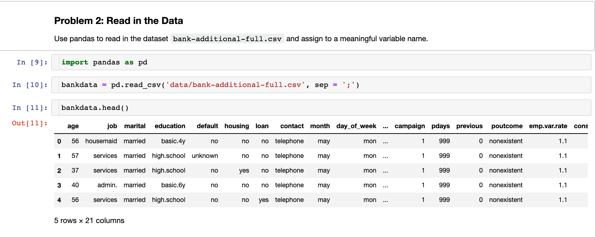

# Project Goal

Our goal is to compare the performance of the classifiers 
 - k-nearest neighbors
 - logistic regression
 - decision trees
 - support vector machines)
 
For this project, we will be using dataset related to the marketing of bank products over the telephone.

# Data

The dataset is from [UCI Machine Learning repository](https://archive.ics.uci.edu/ml/datasets/bank+marketing). The data is from a Portuguese banking institution and is a collection of the results of 17 marketing campaigns run between May 2008 and Nov 2010. The [paper](CRISP-DM-BANK.pdf) has additional details on data features and used for reference.

# Project Deliverables

After understanding, preparing, and modeling your data, build a Jupyter Notebook that includes a clear statement demonstrating your understanding of the business problem, a correct and concise interpretation of descriptive and inferential statistics, your findings (including actionable insights), and next steps and recommendations

## Business problem

The business goal is to find a model that can explain success of a contact, i.e. if the client subscribes the deposit. Such model can increase campaign efficiency by identifying the main characteristics that affect success, helping in a better management of the available resources (e.g. human effort, phone calls, time) and selection of a high quality and affordable set of potential buying customers.

## Data understanding

All the analysis can be found in the python [notebook](Bank_Marketing_DataSet_Analysis.ipynb) to follow the code and operations explained below.

After considering the business understanding, we want to get familiar with our data. For doing that, I first loaded the dataframe by reading the csv file. I also sampled the data to see what type of data we are looking at

## Prepare and Model data

## Comparision of various models

## Next steps and recommendation

