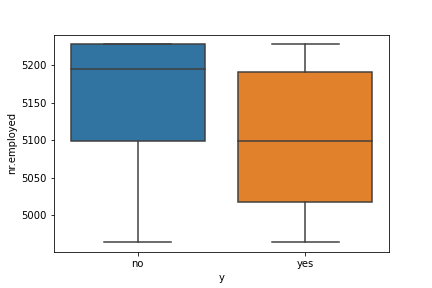

# Project Goal

Our goal is to compare the performance of the classifiers 
 - K-nearest neighbors
 - Logistic regression
 - Decision trees
 - Support vector machines
 
We will be using dataset related to the marketing of bank products over the telephone.

# Data

The dataset is from [UCI Machine Learning repository](https://archive.ics.uci.edu/ml/datasets/bank+marketing). The data is from a Portuguese banking institution and is a collection of the results of 17 marketing campaigns run between May 2008 and Nov 2010. The [paper](CRISP-DM-BANK.pdf) has additional details on data features and used for reference.

# Project Deliverables

After understanding, preparing, and modeling your data, build a Jupyter Notebook that includes a clear statement demonstrating your understanding of the business problem, a correct and concise interpretation of descriptive and inferential statistics, your findings (including actionable insights), and next steps and recommendations

## Business problem

The business goal is to find a model that can explain success of a contact, i.e. if the client subscribes the deposit. Such model can increase campaign efficiency by identifying the main characteristics that affect success, helping in a better management of the available resources (e.g. human effort, phone calls, time) and selection of a high quality and affordable set of potential buying customers.

## Data understanding

All the analysis can be found in the python [notebook](Bank_Marketing_DataSet_Analysis.ipynb) to follow the code and operations explained below.

After considering the business understanding, we want to get familiar with our data. For doing that, I first loaded the dataframe by reading the csv file. I also sampled the data to see what type of data we are looking at

## Prepare and Model data

To start with this I first did a quick box plot to understand the data distribution if numerical variables. The boxplots below show the data.

	

		

	

	

	

Once I did that, I went ahead and checked the age count distibution as shown below

I looked at Education distribution to see how the data is distributed

Them, I did quick correlation matrix to understand the various parameters and how they correlate with each other

As observed from this graph, some features are highly correlated like 'emp.var.rate' and 'cons.cont.idx' and many more as it can be seen from Heatmap so we need to take care of these variables.

Next I used encoders to convert the data to numerical form for easy analysis as shown below

Once the data was in numerical form, I convered the data into training and test set. Please follow along in the [notebook](Bank_Marketing_DataSet_Analysis.ipynb) for individual models that I considered

## Comparision of various models

The table below shows comparision of various models

| Models | Train Time	| Train Accuracy	| Test Accuracy| 
| ------|------|------| ------|
| k-nearest neighbors| 	5.72 µs	| 91.20%	| 88.58%| 
| logistic regression	| 6.91 µs	| 89.94%	| 89.35%| 
| decision trees	| 5.96 µs	| 90.94%	| 89.49%| 
| support vector machines	| 5.01 µs	| 89.42%	| 89.27%| 

## Next steps and recommendation

As seen from the above table "k-nearest neighbors" is the best algorithm in terms of trainig time and accuracy. We would recommend using this model to predict the success of a contact. 

I also used Gridsearch and cross validaiton to tune the paramaters. See table below for performance of the model and various parameters and the scores.

|  GridSearchCV Params	 |  Best Params	|  Best Score |
| ------|------|------|
|Estimators range 10-200	|{'n_estimators': 30}|	0.792954|
|Max depth 2-20	|{'max_depth': 7, 'min_samples_split': 300}	|0.793099|
|Min sample 200-2100	|{'min_samples_leaf': 30, 'min_samples_split': ...	|0.793193|
|Max Features 2-8|	{'max_features': 6}	|0.793093|
|Subsample 0.6-0.9|	{'subsample': 0.85}|	0.794472|