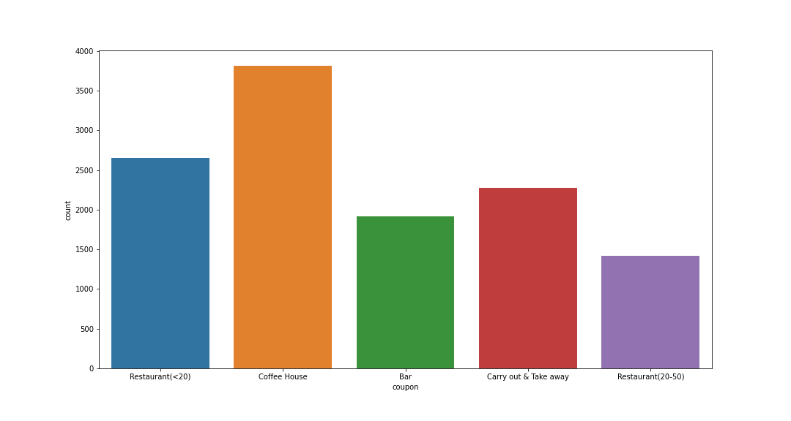

# Customer coupon analysis

## Background

The goal if this exercise is to figure out if a customer accept the coupon. 

To answer this question, we will look at visualizations and probability distributions to distinguish between customers who accepted a driving coupon versus those that did not. 

## Data source

This data comes to us from the UCI Machine Learning repository and was collected via a survey on Amazon Mechanical Turk. The survey describes different driving scenarios, including the destination, current time, weather, passenger, etc., and then asks people whether they will accept the coupon if they are the driver. Answers given that the users will drive there “right away” or “later before the coupon expires” are labeled as “Y = 1”, and answers “no, I do not want the coupon” are labeled as “Y = 0”. There are five different types of coupons—less expensive restaurants (under $20), coffee houses, carry out and take away, bars, and more expensive restaurants ($20–$50).

## Insights

Report highlights the differences between customers who did and did not accept the coupons. To explore the data, we will utilize  knowledge of plotting, statistical summaries, and visualization using Python.

### Analysis of customers using the "Bar"  coupon

Lets look at the data of coupon distribution first

For more details, see [Bar Analysis](.Bar_Analysis.ipynb) notebook
