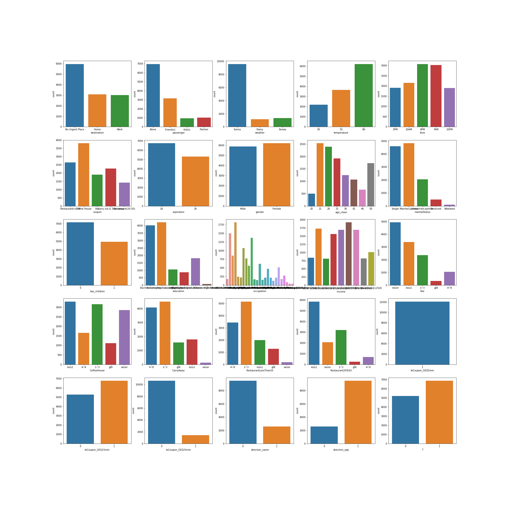
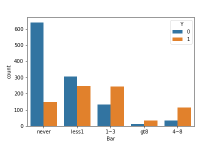

# Customer coupon analysis

## Background

The goal if this exercise is to figure out if a customer accept the coupon. 

To answer this question, we will look at visualizations and probability distributions to distinguish between customers who accepted a driving coupon versus those that did not. 

## Data source

This data comes to us from the UCI Machine Learning repository and was collected via a survey on Amazon Mechanical Turk. The survey describes different driving scenarios, including the destination, current time, weather, passenger, etc., and then asks people whether they will accept the coupon if they are the driver. Answers given that the users will drive there “right away” or “later before the coupon expires” are labeled as “Y = 1”, and answers “no, I do not want the coupon” are labeled as “Y = 0”. There are five different types of coupons—less expensive restaurants (under $20), coffee houses, carry out and take away, bars, and more expensive restaurants ($20–$50).

## Insights by analysing the "Bar" and "Carryout" coupons

Report highlights the differences between customers who did and did not accept the coupons. To explore the data, we will utilize  knowledge of plotting, statistical summaries, and visualization using Python.

### Analysis of customers using the "Bar"  coupon

Before we do the analysis, we need to clean the data. As shown the [Bar Analysis](Bar_Analysis.ipynb) notebook we analysed the data to drop some columns and rows. We also converted age to numeric values, so additional analysis could be done on that dataset.
Lets look at the data of coupon distribution first

To start with look lets look at overall distrubution of data. We plotted this using the subplot function. See below for the data

Next we went on to analyse overall coupon distribution for bar coupons as show in the below figure.

Based on the table below, we observe that acceptance proportion goes up if the patrons go to bar more often. Also, people with lower income value the coupon more and are almost twice as likely to accept it.

Table showing comparision of various data points we collected in the examples above

|Condition|Additional Condition|Acceptance proportion|
|-----|-----|-----|-----|
|Bar coupons accepted|-|0.41191845269210664|
|Bar coupons accepted|Went to bar less than 3 times|0.6464379947229552
|Bar coupons accepted|Went to bar more than 3 times|0.7616580310880829
|Bar coupons accepted|Went to bar more than once and Age 25+|0.6898263027295285
|Bar coupons accepted|Went to bars more than once a month with passengers that were not a kid and had occupations other than farming, fishing, or forestry|0.7094339622641509
|Bar coupons accepted|Went to bars more than once a month, had passengers that were not a kid, and were not widowed|0.6853146853146853
|Bar coupons accepted|Went to bars more than once a month and are under the age of 30|0.7195121951219512
|Bar coupons accepted|Went to cheap restaurants more than 4 times a month and income is less than 50K.|0.8181818181818182

