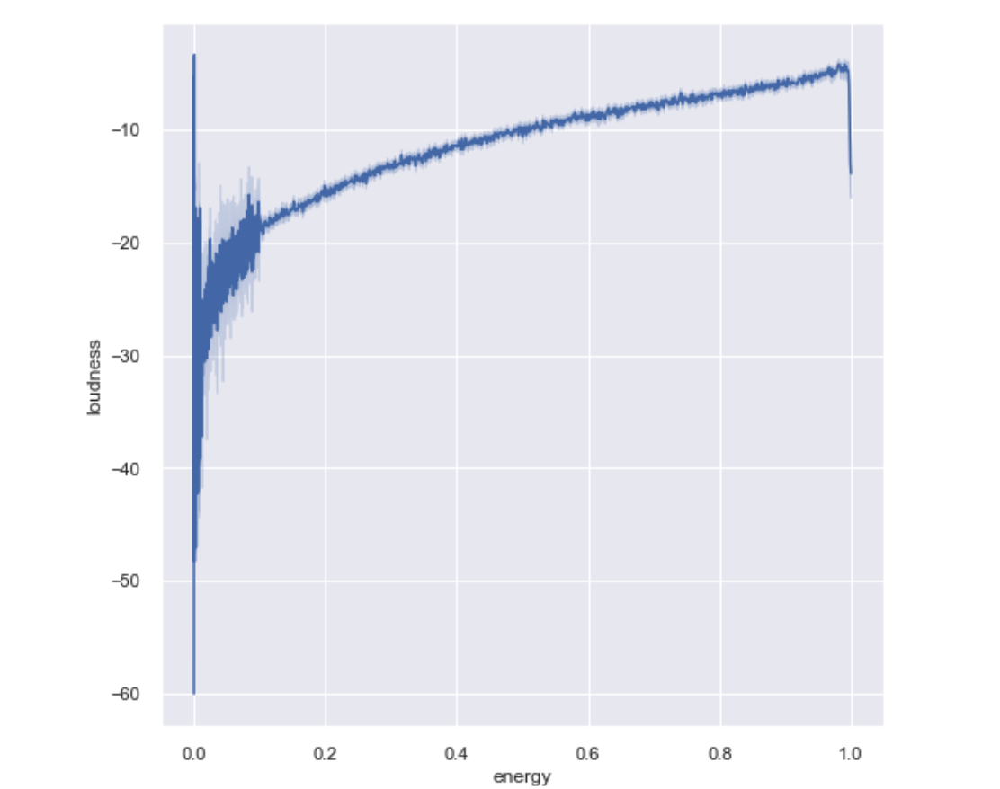

### Spotify Recommendation System

Goal of this project is to create a content-based filtering Spotify Song Recommendation System. As part of creating this system, one of the essential part was to understand how Spotify understands ‘popularity’. Have you ever thought how “Recommended (based on what’s in your playlist)” on your Spotify works? This project helps answer this question and walks through the process of building machine learning pipeline that can help predict what user would like to listen to next.

#### Executive summary

Spotify is a platform that makes money through end users via subscriptions. Spotify song recommendation system will help user discover engaging content to increase DAU (daily active user) metrics. We will use machine learning to filter out the content and present engaging content to the user for increasing their product usage. 

#### Rationale

If users are unable to discover good content, they will move to other competitive platforms for finding music. Good recommendations will help with user retention and in-turn higher revenues for the company.

#### Data Sources

I first started by taking a look at the dataset in [Kaggle](https://www.kaggle.com/datasets/vatsalmavani/spotify-dataset). The dataset was organized in 3 different files

 - data.csv
 - data_by_genres.csv
 - data_by_year.csv
 
Just for additinal context, some of the fields in this dataset are explained below:

 - Instrumentalness: This value represents the amount of vocals in the song. The closer it is to 1.0, the more instrumental the song is
 
 - Acousticness: This value describes how acoustic a song is. A score of 1.0 means the song is most likely to be an acoustic one
 
 - Liveness: This value describes the probability that the song was recorded with a live audience. According to the official documentation “a value above 0.8 provides strong likelihood that the track is live”
 
 - Speechiness: “Speechiness detects the presence of spoken words in a track”. If the speechiness of a song is above 0.66, it is probably made of spoken words, a score between 0.33 and 0.66 is a song that may contain both music and words, and a score below 0.33 means the song does not have any speech
 
 - Energy: “(energy) represents a perceptual measure of intensity and activity. Typically, energetic tracks feel fast, loud, and noisy”
 
 - Danceability: “Danceability describes how suitable a track is for dancing based on a combination of musical elements including tempo, rhythm stability, beat strength, and overall regularity. A value of 0.0 is least danceable and 1.0 is most danceable”
 
 - Valence: “A measure from 0.0 to 1.0 describing the musical positiveness conveyed by a track. Tracks with high valence sound more positive (e.g. happy, cheerful, euphoric), while tracks with low valence sound more negative (e.g. sad, depressed, angry)”.
 
Next, I wanted to explore the spotify's Web API to see if I can extract my personal playlists data. The base URI for all Web API requests is https://api.spotify.com/v1 and spotipy wraps this up neatly for us to use. 

Spotify publishes some of the fields below which will be useful to understand similarities between songs:

 - acousticness number <float>
 A confidence measure from 0.0 to 1.0 of whether the track is acoustic. 1.0 represents high confidence the track is acoustic with value >= 0 and <= 1
 
 -  analysis_url string
 A URL to access the full audio analysis of this track. An access token is required to access this data.

 - danceability number <float>
 Danceability describes how suitable a track is for dancing based on a combination of musical elements including tempo, rhythm stability, beat strength, and overall regularity. A value of 0.0 is least danceable and 1.0 is most danceable.

 - duration_ms integer
 The duration of the track in milliseconds.

 - energy number <float>
 Energy is a measure from 0.0 to 1.0 and represents a perceptual measure of intensity and activity. Typically, energetic tracks feel fast, loud, and noisy. For example, death metal has high energy, while a Bach prelude scores low on the scale. Perceptual features contributing to this attribute include dynamic range, perceived loudness, timbre, onset rate, and general entropy.

 - id string
 The Spotify ID for the track.

 - instrumentalness number <float>
 Predicts whether a track contains no vocals. "Ooh" and "aah" sounds are treated as instrumental in this context. Rap or spoken word tracks are clearly "vocal". The closer the instrumentalness value is to 1.0, the greater likelihood the track contains no vocal content. Values above 0.5 are intended to represent instrumental tracks, but confidence is higher as the value approaches 1.0.

 - key integer
 The key the track is in. Integers map to pitches using standard Pitch Class notation. E.g. 0 = C, 1 = C♯/D♭, 2 = D, and so on. If no key was detected, the value is -1. The values will be >= -1 and <= 11
 - liveness number <float>
 Detects the presence of an audience in the recording. Higher liveness values represent an increased probability that the track was performed live. A value above 0.8 provides strong likelihood that the track is live.

 - loudness number <float>
 The overall loudness of a track in decibels (dB). Loudness values are averaged across the entire track and are useful for comparing relative loudness of tracks. Loudness is the quality of a sound that is the primary psychological correlate of physical strength (amplitude). Values typically range between -60 and 0 db.

 - mode integer
 Mode indicates the modality (major or minor) of a track, the type of scale from which its melodic content is derived. Major is represented by 1 and minor is 0.

 - speechiness number <float>
 Speechiness detects the presence of spoken words in a track. The more exclusively speech-like the recording (e.g. talk show, audio book, poetry), the closer to 1.0 the attribute value. Values above 0.66 describe tracks that are probably made entirely of spoken words. Values between 0.33 and 0.66 describe tracks that may contain both music and speech, either in sections or layered, including such cases as rap music. Values below 0.33 most likely represent music and other non-speech-like tracks.

 - tempo number <float>
 The overall estimated tempo of a track in beats per minute (BPM). In musical terminology, tempo is the speed or pace of a given piece and derives directly from the average beat duration.

 - time_signature integer
 An estimated time signature. The time signature (meter) is a notational convention to specify how many beats are in each bar (or measure). The time signature ranges from 3 to 7 indicating time signatures of "3/4", to "7/4" with value >= 3 and <= 7
 - track_href string
 A link to the Web API endpoint providing full details of the track.

 - type string
 The object type.

 - audio_features uri string
 The Spotify URI for the track.

 - valence number <float>
 A measure from 0.0 to 1.0 describing the musical positiveness conveyed by a track. Tracks with high valence sound more positive (e.g. happy, cheerful, euphoric), while tracks with low valence sound more negative (e.g. sad, depressed, angry) with value >= 0 and <= 1

#### Methodology

First we have to do some data preprocessing for the imported data. As part of data preprocessing, we will find what data is useful and convert some data (eg. genres) to lists for easier operations. As part of useful data selection, we will first drop duplicates in our dataset. Then, we could look into which features are important. 

To do this, I first examined the data to see if there are is any NULL data. Follow along my juptyer notebook for these steps [here](Spotify_Recommendation_System.ipynb)

I did clean up for data by stripping unnessary characters and removing non-english characters

As seen, there are some zero values in the tempo column, but none in the year or duration.

I fixed the tempo values by imputing the values.

 
Next I looked at the correlation between different datasets. From this graph we can start to make connections. E.g, popularity and year have a strong connection. Songs that come out that year have high popularity. Energy and loudness have a strong connection, as we can assume that more loudness = more energy. Danceability and valence are also fairly high, as valence is the "happy" level in music. Dancing is happy!

I also looked at the feature correlation

I looked at the Music data over time. I grouped the data by year to understand the distribution better. As you can see most of the songs are from 1950-2010 and are fairly evenly distrubuted

Further, I reviewed some of the sound features. I ploted them to see how those trends evolved or changed over time. As you can see acousticness and instrumentalness decreased over time, but energy and danceability has trended upwards. These trends may be helpful in predictions.

This dataset contains the audio features for different songs along with the audio features for different genres. We can use this information to compare different genres and understand their unique differences in sound.

Next, I did some analysis to understand the data. A

As you can see, upwards trend in danceability from 1920 until a downward trend from approximately 1930-35. would assume because of the war. This graph shows an upward trend in danceability from about 1945-1950 onwards... coinciding with the end of WWII and the onset of the 60. Fast upward trend from the 1950s onward, probably from the end of WWII and the ability to make more music, as well as people being able to listen to music, AND the steep jump in the early 2000s as a result of streaming.

Interesting...some songs are loud but low energy, and fewer still that are high energy but quieter than average as seen at the top and tail ends of the graph. The general consensus is that as the songs increase in loudness, the energy increases.

I also took a closer look at top 10 tracks and artists.

Another data point I wanted to check was how may songs are released per year, and whether that data is skewed for specific years. 

For the top generes, I checked if there is specific pattern around audio features

Next I wanted to check if there is specific clustering of data. For this I used the KMeans clustering algorithm. and fitted a pipeline and plotted it for genres.

The essential question for me was: could we use a song’s attributes to predict a track’s ‘popularity’, so I looked into building some models and understanding how this could be predicted well. For this I built two models. In next sectiion I set up the models and do GridSearch to find the best parameters.

Next we examine if there is any specific signatures for songs too. 

##### Building models and Gridsearch for parameters

Lets just first fit DecisionTree algorithm. As you can see the mean square error is pretty high with default parameters.

Using the GridSearchCV, we fitted the model again to reduce the mean square error

The resulting dtree graph is below

The other model I was to use KNeighborsRegressor. The steps below show the model and hyperparameter tuning done for this model

#### Results

#### Next steps

##### Contact and Further Information

Akash Choudhari
akashtc@gmail.com